# ColorValue Design Decision

**English** | [Magyar]

## Overview

This document explains why we created a custom `ColorValue` record type instead of using existing .NET color types like `System.Drawing.Color` or `Microsoft.Maui.Graphics.Color`.

## Problem Statement

We needed a platform-independent color representation that could be used in:
- **Shared ViewModels** (cross-platform business logic)
- **MAUI application** (Android, iOS, Windows, macOS)
- **Blazor application** (WebAssembly, Server)

The challenge was finding a color type that works across all these platforms without introducing platform-specific dependencies.

## Options Considered

### Option 1: System.Drawing.Color

**Description:**
Use the standard `System.Drawing.Color` struct from the .NET Framework/Core.

```csharp
using System.Drawing;

Color color = Color.FromArgb(255, 102, 255, 102);
```

**Pros:**
- ✅ Standard .NET type, widely known
- ✅ Built-in conversions (FromArgb, ToArgb, FromName)
- ✅ Rich API (IsKnownColor, GetBrightness, etc.)
- ✅ Extensive documentation and community support

**Cons:**
- ❌ **Only supported on Windows in .NET 6+**
  - Runtime warning on Linux/macOS: `System.Drawing.Common is only supported on Windows`
  - See [.NET 6 Breaking Change]
- ❌ Struct (not record), requires manual equality implementation
- ❌ No built-in CSS or hex string conversions
- ❌ Would prevent true cross-platform deployment

**Verdict:** ❌ Rejected due to platform limitations

---

### Option 2: Microsoft.Maui.Graphics.Color

**Description:**
Use the `Color` class from Microsoft.Maui.Graphics, which is part of the .NET MAUI graphics library.

```csharp
using Microsoft.Maui.Graphics;

Color color = Color.FromRgba(102, 255, 102, 255);
```

**Pros:**
- ✅ Cross-platform within MAUI ecosystem
- ✅ Modern, well-designed API
- ✅ Built-in FromHex/ToHex support
- ✅ First-class MAUI integration

**Cons:**
- ❌ **Shared project cannot reference MAUI packages**
  - Shared projects should remain platform-agnostic
  - Would create circular dependencies
- ❌ **Blazor cannot use MAUI types**
  - Blazor runs in browser (WebAssembly) or server
  - No access to MAUI runtime
- ❌ Forces ViewModels to be MAUI-specific

**Verdict:** ❌ Rejected due to platform coupling

---

### Option 3: Custom ColorValue Record (Selected)

**Description:**
Create a lightweight, immutable record type in the Shared project.

```csharp
namespace Fallout.TerminalHacker.Models;

public record ColorValue(byte R, byte G, byte B, byte A = 255)
{
    public static ColorValue FromHex(string hex);
    public string ToHex(bool includeAlpha = false);
    public string ToCssRgba();
    public string ToCssRgb();
    
    public static ColorValue Transparent { get; }
    public static ColorValue White { get; }
    public static ColorValue Black { get; }
}
```

**Pros:**
- ✅ **Zero dependencies** - no external libraries required
- ✅ **Truly cross-platform** - works on any .NET platform
- ✅ **Record type** - value equality, immutability, pattern matching
- ✅ **Customizable conversions** - tailored to our needs (CSS, hex)
- ✅ **Works in MAUI, Blazor, and any future platforms**
- ✅ **Full control** over API and behavior
- ✅ **Lightweight** - only 4 bytes (R, G, B, A)

**Cons:**
- ❌ Custom code maintenance
- ❌ Not a standard .NET type
- ❌ Need to write our own converters

**Verdict:** ✅ **Selected** - Best fits our cross-platform requirements

## Implementation Details

### ColorValue API

```csharp
// Creation
var color = new ColorValue(102, 255, 102);           // RGB
var color = new ColorValue(102, 255, 102, 255);     // RGBA
var color = ColorValue.FromHex("#66ff66");          // From hex string

// Conversion
string hex = color.ToHex();                          // "#66ff66"
string rgba = color.ToCssRgba();                     // "rgba(102, 255, 102, 1.0)"
string rgb = color.ToCssRgb();                       // "rgb(102, 255, 102)"

// Predefined colors
ColorValue.Transparent  // rgba(0, 0, 0, 0)
ColorValue.White        // rgb(255, 255, 255)
ColorValue.Black        // rgb(0, 0, 0)
```

### Platform-Specific Converters

**MAUI:**
```csharp
// ColorValueToColorConverter.cs
public class ColorValueToColorConverter : IValueConverter
{
    public object? Convert(object? value, Type targetType, ...)
    {
        if (value is ColorValue colorValue)
            return Color.FromRgba(colorValue.R, colorValue.G, 
                                  colorValue.B, colorValue.A);
        return Colors.Transparent;
    }
}
```

**Blazor (future):**
```csharp
// In Razor component
<div style="background-color: @buttonViewModel.BackgroundColor.ToCssRgb()">
    Terminal Button
</div>
```

## Usage in Architecture

### Layer Diagram



Diagram source: [ColorValue-LayerDiagram.mmd](../Images/ColorValue-LayerDiagram.mmd). Other formats: [PlantUML](../Images/ColorValue-LayerDiagram.puml), [DOT](../Images/ColorValue-LayerDiagram.gv), [draw.io](../Images/ColorValue-LayerDiagram.drawio).

### Benefits Achieved

1. **True Cross-Platform ViewModels**
   - ViewModels in `Shared` project work everywhere
   - No platform-specific types in business logic
   - Unit testable without UI dependencies

2. **Flexible Presentation**
   - MAUI: Convert to `Microsoft.Maui.Graphics.Color`
   - Blazor: Convert to CSS strings
   - Future platforms: Add custom converters

3. **Consistent Behavior**
   - Color calculations identical across platforms
   - Same hex/RGB values everywhere
   - Predictable color manipulation

4. **Maintainability**
   - Single source of truth for color logic
   - Easy to extend (e.g., add HSL conversions)
   - No external dependency updates required

## Testing

The `ColorValue` type is fully unit tested:

```csharp
[TestFixture]
public class ColorValueTests
{
    [Test]
    public void FromHex_ValidHex_CreatesCorrectColor()
    {
        var color = ColorValue.FromHex("#66ff66");
        Assert.That(color.R, Is.EqualTo(102));
        Assert.That(color.G, Is.EqualTo(255));
        Assert.That(color.B, Is.EqualTo(102));
    }
    
    [Test]
    public void ToCssRgba_ReturnsValidCssString()
    {
        var color = new ColorValue(102, 255, 102, 255);
        Assert.That(color.ToCssRgba(), Is.EqualTo("rgba(102, 255, 102, 1.0)"));
    }
}
```

## Future Considerations

### Optional: System.Drawing.Color Bridge (Windows-only)

For developers working exclusively on Windows, we could add optional conversions:

```csharp
public record ColorValue(byte R, byte G, byte B, byte A = 255)
{
    #if NET6_0_OR_GREATER && WINDOWS
    public System.Drawing.Color ToSystemDrawingColor() 
        => System.Drawing.Color.FromArgb(A, R, G, B);
    
    public static ColorValue FromSystemDrawingColor(System.Drawing.Color color)
        => new(color.R, color.G, color.B, color.A);
    #endif
}
```

This would only be available on Windows and would be clearly documented as platform-specific.

### Possible Extensions

1. **HSL/HSV support**
   ```csharp
   public (double H, double S, double L) ToHsl();
   public static ColorValue FromHsl(double h, double s, double l);
   ```

2. **Color manipulation**
   ```csharp
   public ColorValue Lighten(double amount);
   public ColorValue Darken(double amount);
   public ColorValue WithAlpha(byte alpha);
   ```

3. **Color interpolation**
   ```csharp
   public static ColorValue Lerp(ColorValue a, ColorValue b, double t);
   ```

## Conclusion

The custom `ColorValue` record type was chosen as the best solution for our cross-platform requirements. While it requires maintaining custom code, the benefits of true platform independence, flexible conversion, and zero dependencies outweigh the costs.

This decision enables us to:
- ✅ Share ViewModels between MAUI and Blazor
- ✅ Write platform-agnostic business logic
- ✅ Unit test color-related functionality easily
- ✅ Deploy to any .NET platform without restrictions

## References

- [.NET 6 System.Drawing.Common Breaking Change][.NET 6 Breaking Change]
- [Microsoft.Maui.Graphics Documentation]
- [C# Records Documentation](https://learn.microsoft.com/en-us/dotnet/csharp/language-reference/builtin-types/record)

[//]: #References-and-image-links

[.NET 6 Breaking Change]: https://learn.microsoft.com/en-us/dotnet/core/compatibility/core-libraries/6.0/system-drawing-common-windows-only
[Microsoft.Maui.Graphics Documentation]: https://learn.microsoft.com/en-us/dotnet/maui/user-interface/graphics/
[C# Records Documentation]: https://learn.microsoft.com/en-us/dotnet/csharp/language-reference/builtin-types/record
---

**Document Version:** 1.0  
**Last Updated:** 2026-01-05  
**Author:** AI Assistant  
**Status:** Approved

[Magyar]: ./ColorValue-Design-Decision.hu.md


