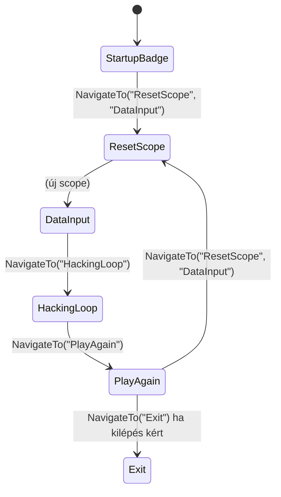

# Fázisnavigációs állapotgép (konzol)

**Magyar** | [English]

## Áttekintés

A RAVEN konzolalkalmazás (és a SPARROW által is használt közös fáziskontraktus) egy **NavigationService-alapú állapotgépet** használ a végrehajtás vezérlésére. A fázisok elnevezett, futtatható lépések, amelyek a következő fázist a `INavigationService.NavigateTo(phaseName, args...)` hívással határozzák meg. A futtató (pl. az [Application]) név alapján feloldja a következő fázist, a tárolt argumentumokat átadja a `Run(args)` hívásnak, és addig lépked, amíg a fázis neve nem `"Exit"`. Ez a dokumentum az elméletet, a **Result minta** (FluentResults) szerepét a siker és hiba kezelésében, valamint a **DI scope kezelést** (köztük a ResetScope fázist) írja le.

**Hatókör:** Ez az architektúra a konzol belépési ponthoz tartozik: a [RAVEN] teljes mértékben ezt használja (navigációval és scope reseteléssel); a [SPARROW] ugyanazt az `IPhase` / `Result Run(params object[] args)` kontraktust használja, de a fázisokat rögzített sorrendben futtatja az `IPhaseRunner` révén, `INavigationService` nélkül.

---

## Alapvető absztrakciók

### IPhase (Enclave.Shared.Phases)

Minden fázis implementálja az [IPhase]-t:

- **`string Name { get; }`** — Egyedi azonosító, amelyet a fázisregiszter és a navigáció használ (pl. `"StartupBadge"`, `"DataInput"`, `"ResetScope"`).
- **`Result Run(params object[] args)`** — Futtatja a fázist. Sikeres lefutás esetén `Result.Ok()`-ot ad vissza, átmenetnél a `NavigateTo(...)` visszatérési értékét, hibánál pedig `Result.Fail(...)`-t.

A fázisok **opcionális argumentumokat** kapnak az előző fázistól: aki a `NavigateTo("KövetkezőFázis", arg1, arg2)` hívást intézte, azért a futtató a `KövetkezőFázis.Run(arg1, arg2)` hívást hajtja végre.

### INavigationService (Enclave.Shared.Phases)

A navigációs szolgáltatás tárolja a **következő fázis nevét** és **argumentumait** a futtató számára. Nincs külön „kezdő fázis beállítás” metódus; a gazda a **`NavigateTo("StartupBadge")`** hívással indít.

- **`string? NextPhase { get; }`** — A következőként futtatandó fázis neve (a `NavigateTo` állítja).
- **`IReadOnlyList<object> NextPhaseArgs { get; }`** — Ezeket az argumentumokat kapja meg a következő fázis `Run(params object[] args)` metódusa.
- **`Result NavigateTo(string phaseName, params object[] args)`** — Normál fázisoknál: beállítja a `NextPhase`-t és a `NextPhaseArgs`-ot, és `Result.Ok()`-ot ad vissza. **`"Exit"`** esetén: az első argumentum lehet egy `Result` (pl. sikertelen result a kilépés okának továbbadására); ha megvan, azt adja vissza, különben `Result.Fail(new ApplicationExit())`. Így a futtató **`while (result.IsSuccess)`** ciklust használhat, és bármely sikertelen result kilépést jelent; opcionálisan kiírja a `result.Errors`-t, ha a hiba nem `ApplicationExit` (normál kilépés).

A vezérlés nem kivételdobással történik; a navigáció és a kilépés visszatérési értékeken és tárolt állapoton keresztül történik.

---

## Futtató hurok (Application)

A RAVEN [Application] osztály a fő hurkot valósítja meg:

1. **Inicializálás** — `var result = navigation.NavigateTo("StartupBadge");` (ugyanaz az API, mint a fázisoknál; nincs külön kezdő fázis beállítás).
2. **Hurok** — **`while (result.IsSuccess)`**:
   - Kiolvasás: `nextPhase = navigation.NextPhase`; ha null vagy üres, break.
   - **IPhaseRegistry** feloldása a jelenlegi scope-ból: `currentScope.CurrentScope.ServiceProvider.GetRequiredService<IPhaseRegistry>()`.
   - **`getPhaseResult = phaseRegistry.GetPhase(nextPhase)`** hívás. Ha `getPhaseResult.IsFailed`, akkor `result = Result.Fail(getPhaseResult.Errors)` és break; különben **`phase = getPhaseResult.Value`**.
   - Argumentumok: `nextArgs = navigation.NextPhaseArgs?.ToArray() ?? []`.
   - **`result = phase.Run(nextArgs)`** (a `result` újrafelhasználása; nincs külön `if (result.IsFailed)` blokk — a kilépést a `!result.IsSuccess` jelzi).
3. **Hurok után** — Ha `result.IsFailed` és bármely hiba **nem** `ApplicationExit`, kiírja a `result.Errors`-t (pl. a canvasra). Ezután visszatérés `result`-tal (pl. folyamat kilépéskódhoz).

Tehát a **fázisok nem dobnak kivételt navigáció miatt**; `Result`-ot adnak vissza. Az **Exit** „fázist” a navigációs szolgáltatás valósítja meg: a `NavigateTo("Exit")` vagy `NavigateTo("Exit", someResult)` sikertelen `Result`-ot ad vissza (opcionálisan a megadottat), így a `result.IsSuccess` hamis és a hurok véget ér.

---

## Result minta (FluentResults) — Hibakezelés

### Miért Result kivétel helyett

- **Vezérlés** — A normál „lépj a következő fázisra” a `return navigation.NavigateTo("KövetkezőFázis", ...)` formában jelenik meg. Nem dobódik kivétel; a metódus egyszerűen sikeres `Result`-ot ad vissza.
- **Kifejezett hibák** — Ha egy fázis hibára fut (pl. érvénytelen bemenet, I/O hiba), akkor `Result.Fail(...)`-t ad vissza kivétel dobása helyett. A futtató egy helyen kezelheti a hibát, és dönthet úgy, hogy kilép vagy üzenetet mutat.

### Használat a fázisokban

- **Siker / navigáció:**  
  `return navigation.NavigateTo("KövetkezőFázis");` vagy `return navigation.NavigateTo("ResetScope", "DataInput");`  
  Ezek `Result.Ok()`-ot adnak vissza, és beállítják a következő fázist és argumentumait.
- **Kilépés (normál vagy indokkal):**  
  `return navigation.NavigateTo("Exit");` (visszaadja a `Result.Fail(new ApplicationExit())`) vagy `return navigation.NavigateTo("Exit", myResult);` a kilépés okának továbbadására. A futtató **`while (result.IsSuccess)`** ciklusa ezután véget ér; ha a hiba nem `ApplicationExit`, kiírja a `result.Errors`-t.
- **Siker / nincs arg:**  
  `return Result.Ok();` (olyan fázisoknál, amelyek nem navigálnak, pl. SPARROW).
- **Hiba (és kilépés):**  
  `return navigation.NavigateTo("Exit", Result.Fail(...));` — a futtató kilép és kiírhatja a hibát.

### Futtató viselkedés

- **Application** — A hurok **`while (result.IsSuccess)`**; nincs külön „ha sikertelen, állítsd Exit-re”. A hurok után, ha `result.IsFailed` és van olyan hiba, ami nem `ApplicationExit`, kiírja a `result.Errors`-t a canvasra; ezután visszatérés `result`-tal.
- **Program** — `var result = app.Run(); return result.IsSuccess ? 0 : 1;` — a folyamat kilépéskódja tükrözi a sikertelenséget.

Tehát a **fázis „kivételei” nem dobnak**; `Result`-ként jönnek vissza. Az **Exit** viselkedést a `NavigateTo("Exit", ...)` implementálja (sikertelen `Result`-ot ad vissza), így a ciklusfeltétel egyszerű marad.

---

## DI scope kezelés

### Miért fontos a scope

A scoped szolgáltatások (pl. `IGameSession`) scope-onként egyszer oldódnak fel. A RAVEN-nél minden **játékmenet** kapjon **új** `IGameSession`-t (és új példányt a tőle függő fázisokból). Ehhez a scope-t a DataInput fázis (amely kitölti a sessiont) **előtt** kell **resetelni**.

### ICurrentScope

- **`IServiceScope CurrentScope { get; }`** — A fázisok és scoped szolgáltatások feloldásához használt „jelenlegi” scope. Első hozzáféréskor jön létre.
- **`void ResetScope()`** — Eldobja a jelenlegi scope-ot és újat hoz létre. A következő `CurrentScope` hozzáférés az új scope-ot adja.

A futtató **mindig** a `currentScope.CurrentScope.ServiceProvider`-ból oldja fel a következő fázist. Így scope reset után a következő fázis és minden scoped függőség (pl. `IDataInputPhase`, `IGameSession`) az **új** scope-ból jön.

### ResetScope fázis

A **ResetScope** fázis **nem** a DI-ból kapja a cél fázis nevét. **Argumentumként** kapja a hívótól:

- Hívó (pl. StartupBadge vagy PlayAgain):  
  `return navigation.NavigateTo("ResetScope", "DataInput");`
- A futtató a **ResetScopePhase**-t így hívja: `Run("DataInput")` (tehát `args = ["DataInput"]`).
- **ResetScopePhase.Run(args)**:
  - Cél fázis név: `args[0]`, ha van és string, különben alapértelmezett `"DataInput"`.
  - Meghívja a `scopeHolder.ResetScope()` (új scope).
  - Visszatérés: `navigation.NavigateTo(targetPhaseName)` (többlet argumentum nélkül).

Így a **következő** fázis (pl. DataInput) az **új** scope-ból oldódik fel, és friss `IGameSession`-t kap. A cél fázis neve **nem** konstruktor-függőség; futási időben a `Run(args)` argumentumokon keresztül érkezik.

### Folyamat és scope életciklus

- **StartupBadge** az **első** scope-ban fut (amikor az első fázis feloldódik).
- **NavigateTo("ResetScope", "DataInput")** → A futtató ugyanabban a scope-ban futtatja a **ResetScope**-ot; az meghívja a `ResetScope()`-ot, majd a **DataInput** az **új** scope-ból oldódik fel.
- **DataInput** → **HackingLoop** (ugyanaz a scope, ugyanaz a session).
- **HackingLoop** → **PlayAgain** (ugyanaz a scope).
- **PlayAgain** → **NavigateTo("ResetScope", "DataInput")** → ismét a ResetScope reseteli a scope-ot, majd a DataInput új scope-ban fut a következő menetre.

A **scope resetek** tehát explicitek (ResetScope fázis) és **paraméterezettek** (cél fázis név az `args`-ban), DI-beli rögzítés nélkül.

---

## Fázisfolyamat (RAVEN)

### Összefoglaló táblázat

| Fázis        | Feloldás scope-ból   | Tipikus következő lépés                     |
|-------------|----------------------|---------------------------------------------|
| StartupBadge | Kezdeti scope        | `NavigateTo("ResetScope", "DataInput")`     |
| ResetScope  | Jelenlegi scope      | `ResetScope()` majd `NavigateTo(args[0])`   |
| DataInput   | Új scope (reset után) | `NavigateTo("HackingLoop")`                 |
| HackingLoop | DataInput-tal azonos scope | `NavigateTo("PlayAgain")`            |
| PlayAgain   | Ugyanaz a scope      | `NavigateTo("ResetScope", "DataInput")` vagy `NavigateTo("Exit")` |
| Exit        | —                    | A futtató megáll a ciklussal                |

---

## Opcionális paraméterek a fázisok között

- **NavigateTo(phaseName, params object[] args)** — Az `args`-ot a `NextPhaseArgs`-ba menti.
- **Run(params object[] args)** — A futtató a `NextPhaseArgs`-ot adja át a következő fázis `Run(args)` hívásának.

Így bármely fázis adatot adhat a következőnek (pl. a ResetScope a cél fázis nevet kapja; a jövőben más fázisok is adhatnak opciókat vagy kontextust). A fázisok, amelyeknek nincs szükségük argumentumra, figyelmen kívül hagyhatják az `args`-ot.

---

## Regisztráció és feloldás

- **IPhaseRegistry** — A megadott névhez tartozó fázis **példányt** adja a jelenlegi scope-ból. A **PhaseRegistry** **scoped**-ként van regisztrálva; konstruktorában **`IEnumerable<IPhase>`**-t kap (a scope összes fázisa, DI-től). A **`GetPhase(phaseName)`** **`Result<IPhase>`**-t ad vissza: a névhez tartozó fázist (`IPhase.Name`), vagy **`Result.Fail(NotFoundError)`**-t, ha nincs ilyen. Nincs külön név→Type map; a regiszter a scope fázispéldányait tartja.
- **ICurrentScope** — Tárolja a jelenlegi `IServiceScope`-ot; a futtató az **IPhaseRegistry**-t és a fázisokat a `CurrentScope.ServiceProvider`-ból oldja fel.
- A fázisok **scoped**-ként vannak regisztrálva (pl. `AddScoped<IDataInputPhase, DataInputPhase>()` és **`AddScoped<IPhase>(sp => sp.GetRequiredService<IDataInputPhase>())`**, hogy az `IEnumerable<IPhase>` összegyűjtse őket). Minden scope saját **PhaseRegistry**-t és saját fázispéldányokat (és **IGameSession**-t) kap.

A futtató minden iterációban a jelenlegi scope-ból oldja fel az **IPhaseRegistry**-t, és a **GetPhase(nextPhase)** hívással kapja meg a fázispéldányt (vagy sikertelen Result-ot); új scope-ot csak a **ResetScope** fázison keresztül hoz létre.

---

## Hivatkozások

- [RAVEN követelmények][raven-kovetelmenyek] — RAVEN viselkedés és fázisok
- [Projektstruktúra][projekt-struktura] — Shared, Core és alkalmazási rétegek
- [Állapotgép][allapotgep] — MainViewModel állapotgép (MAUI/Blazor; más, mint ez a fázisgép)

[English]: ./Phase-Navigation-State-Machine.md
[RAVEN]: ./RAVEN-Requirements.hu.md
[SPARROW]: ./SPARROW-Requirements.hu.md
[IPhase]: ../../src/dotnet/Shared/Phases/IPhase.cs
[Application]: ../../src/dotnet/Enclave.Raven/Application.cs
[Startup]: ../../src/dotnet/Enclave.Raven/Startup.cs
[raven-kovetelmenyek]: ./RAVEN-Requirements.hu.md
[projekt-struktura]: ./ProjectStructure.hu.md
[allapotgep]: ./StateMachine.hu.md
