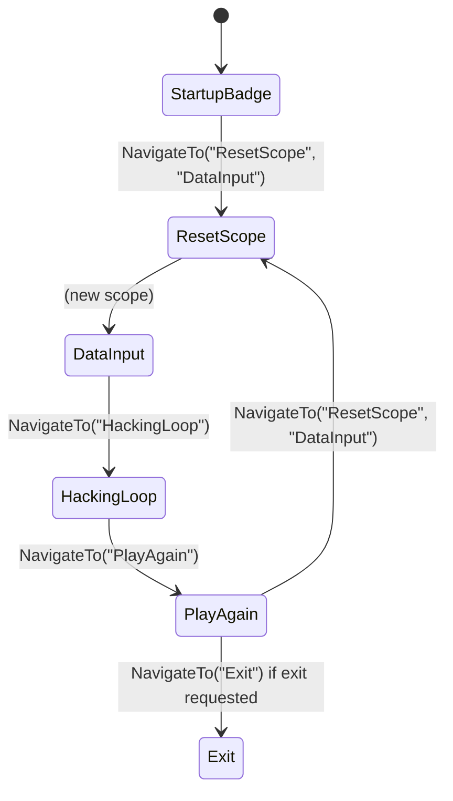

# Phase Navigation State Machine (Console)

**English** | [Magyar]

## Overview

The RAVEN console application (and the shared phase contract used by SPARROW) uses a **NavigationService-based state machine** to drive execution. Phases are named, runnable steps that decide the next phase by calling `INavigationService.NavigateTo(phaseName, args...)`. The runner (e.g. `Application`) resolves the next phase by name, passes stored arguments to `Run(args)`, and continues until the phase name is `"Exit"`. This document describes the design, the **Result pattern** (FluentResults) for success and error handling, and **DI scope management** (including the ResetScope phase).

**Scope:** This architecture applies to the console entry point: [RAVEN] uses it in full (with navigation and scope reset); [SPARROW] uses the same `IPhase` / `Result Run(params object[] args)` contract but runs phases in a fixed order via `IPhaseRunner` without `INavigationService`.

---

## Core Abstractions

### IPhase (Enclave.Shared.Phases)

Every phase implements [IPhase]:

- **`string Name { get; }`** — Unique identifier used by the phase registry and navigation (e.g. `"StartupBadge"`, `"DataInput"`, `"ResetScope"`).
- **`Result Run(params object[] args)`** — Executes the phase. Returns `Result.Ok()` on success, or the result of `NavigateTo(...)` when transitioning, or `Result.Fail(...)` to report an error to the runner.

Phases receive **optional arguments** from the previous phase: whoever called `NavigateTo("NextPhase", arg1, arg2)` causes the runner to invoke `NextPhase.Run(arg1, arg2)`.

### INavigationService (Enclave.Shared.Phases)

The navigation service holds the **next phase name** and **arguments** for the runner. There is no separate “set initial phase” method; the host calls **`NavigateTo("StartupBadge")`** to start.

- **`string? NextPhase { get; }`** — Name of the phase to run next (set by `NavigateTo`).
- **`IReadOnlyList<object> NextPhaseArgs { get; }`** — Arguments to pass to that phase’s `Run(params object[] args)`.
- **`Result NavigateTo(string phaseName, params object[] args)`** — For normal phases: sets `NextPhase` and `NextPhaseArgs` and returns `Result.Ok()`. For **`"Exit"`**: the first argument may be a `Result` (e.g. a failed result to communicate exit reason); if present, that result is returned; otherwise returns `Result.Fail(new ApplicationExit())`. So the runner can use **`while (result.IsSuccess)`** and treat any non-success as exit; optionally it dumps `result.Errors` when the error is not `ApplicationExit` (normal exit).

No exceptions are thrown for control flow; navigation and exit are expressed via return values and stored state.

---

## Runner Loop (Application)

The RAVEN [Application] class implements the main loop:

1. **Initialize** — `var result = navigation.NavigateTo("StartupBadge");` (same API as phases; no separate “set initial phase”).
2. **Loop** — **`while (result.IsSuccess)`**:
   - Read `nextPhase = navigation.NextPhase`; if null or empty, break.
   - Resolve **IPhaseRegistry** from the current scope: `currentScope.CurrentScope.ServiceProvider.GetRequiredService<IPhaseRegistry>()`.
   - Call **`getPhaseResult = phaseRegistry.GetPhase(nextPhase)`**. If `getPhaseResult.IsFailed`, set `result = Result.Fail(getPhaseResult.Errors)` and break; otherwise **`phase = getPhaseResult.Value`**.
   - Get args: `nextArgs = navigation.NextPhaseArgs?.ToArray() ?? []`.
   - **`result = phase.Run(nextArgs)`** (reuse `result`; no extra `if (result.IsFailed)` block — exit is implied by `!result.IsSuccess`).
3. **After loop** — If `result.IsFailed` and any error is **not** `ApplicationExit`, dump `result.Errors` (e.g. to the canvas). Then return `result` (e.g. for process exit code).

Thus, **phases never throw for navigation**; they return `Result`. The **Exit** “phase” is implemented by the navigation service: `NavigateTo("Exit")` or `NavigateTo("Exit", someResult)` returns a failing `Result` (optionally the provided one), so `result.IsSuccess` is false and the loop ends.

---

## Result Pattern (FluentResults) — Error Handling

### Why Result Instead of Exceptions

- **Control flow** — Normal “go to next phase” is expressed as `return navigation.NavigateTo("NextPhase", ...)`. No exception is thrown; the method simply returns a successful `Result`.
- **Explicit errors** — If a phase fails (e.g. invalid input, I/O error), it returns `Result.Fail(...)` instead of throwing. The runner can handle failure in one place and decide whether to exit or show a message.

### Usage in Phases

- **Success / navigate:**  
  `return navigation.NavigateTo("NextPhase");` or `return navigation.NavigateTo("ResetScope", "DataInput");`  
  These return `Result.Ok()` and set the next phase and args.
- **Exit (normal or with reason):**  
  `return navigation.NavigateTo("Exit");` (returns `Result.Fail(new ApplicationExit())`) or `return navigation.NavigateTo("Exit", myResult);` to communicate an exit reason. The runner’s **`while (result.IsSuccess)`** then exits; if the failure is not `ApplicationExit`, it dumps `result.Errors`.
- **Success / no args:**  
  `return Result.Ok();` (used by phases that do not navigate, e.g. in SPARROW).
- **Failure (and exit):**  
  `return navigation.NavigateTo("Exit", Result.Fail(...));` so the runner exits and can dump the error.

### Runner Behaviour

- **Application** — Loop is **`while (result.IsSuccess)`**; no explicit “if failed then set Exit”. After the loop, if `result.IsFailed` and any error is not `ApplicationExit`, dump `result.Errors` to the canvas; then return `result`.
- **Program** — `var result = app.Run(); return result.IsSuccess ? 0 : 1;` so the process exit code reflects failure.

So **phase “exceptions” are not thrown**; they are returned as `Result`. The **Exit** behaviour is implemented inside `NavigateTo("Exit", ...)` (returns a failing `Result`), so the loop condition stays simple.

---

## DI Scope Handling

### Why Scope Matters

Scoped services (e.g. `IGameSession`) are resolved once per scope. For RAVEN, each **game round** should get a **new** `IGameSession` (and new instances of phases that depend on it). So the scope must be **reset** before the DataInput phase (which fills the session) and again before each new round.

### ICurrentScope

- **`IServiceScope CurrentScope { get; }`** — The “current” scope used to resolve phases and scoped services. Created lazily on first access.
- **`void ResetScope()`** — Disposes the current scope and creates a new one. The next access to `CurrentScope` returns the new scope.

The runner **always** resolves the next phase from `currentScope.CurrentScope.ServiceProvider`. So when the scope is reset, the next phase and all scoped dependencies (e.g. `IDataInputPhase`, `IGameSession`) are resolved from the **new** scope.

### ResetScope Phase

The **ResetScope** phase does not take a target phase name from DI. It receives it as an **argument** from the caller:

- Caller (e.g. StartupBadge or PlayAgain):  
  `return navigation.NavigateTo("ResetScope", "DataInput");`
- Runner invokes **ResetScopePhase** with `Run("DataInput")` (i.e. `args = ["DataInput"]`).
- **ResetScopePhase.Run(args)**:
  - Reads target phase name: `args[0]` if present and is string, otherwise default `"DataInput"`.
  - Calls `scopeHolder.ResetScope()` (new scope).
  - Returns `navigation.NavigateTo(targetPhaseName)` (no extra args).

So the **next** phase (e.g. DataInput) is resolved from the **new** scope and gets a fresh `IGameSession`. The target phase name is **not** a constructor dependency; it is passed at runtime via `Run(args)`.

### Flow and Scope Lifetime

- **StartupBadge** runs in the **first** scope (created when the first phase is resolved).
- **NavigateTo("ResetScope", "DataInput")** → Runner runs **ResetScope** in the same scope; it calls `ResetScope()`, then **DataInput** is resolved from the **new** scope.
- **DataInput** → **HackingLoop** (same scope, same session).
- **HackingLoop** → **PlayAgain** (same scope).
- **PlayAgain** → **NavigateTo("ResetScope", "DataInput")** → again, ResetScope resets the scope, then DataInput runs in a new scope for the next round.

So **scope resets** are explicit (ResetScope phase) and **parameterised** (target phase name in `args`), without hard-coding the target in DI.

---

## Phase Flow (RAVEN)

### Summary Table

| Phase         | Resolved from scope | Typical next step                          |
|---------------|---------------------|---------------------------------------------|
| StartupBadge  | Initial scope       | `NavigateTo("ResetScope", "DataInput")`     |
| ResetScope    | Current scope       | `ResetScope()` then `NavigateTo(args[0])`   |
| DataInput     | New scope (after reset) | `NavigateTo("HackingLoop")`             |
| HackingLoop   | Same scope as DataInput | `NavigateTo("PlayAgain")`               |
| PlayAgain     | Same scope          | `NavigateTo("ResetScope", "DataInput")` or `NavigateTo("Exit")` |
| Exit          | —                   | Runner stops loop                           |

---

## Optional Parameters Between Phases

- **NavigateTo(phaseName, params object[] args)** — Stores `args` in `NextPhaseArgs`.
- **Run(params object[] args)** — The runner passes `NextPhaseArgs` into the next phase’s `Run(args)`.

So any phase can pass data to the next (e.g. ResetScope receives the target phase name; in the future, other phases could pass options or context). Phases that do not need arguments can ignore `args`.

---

## Registration and Resolution

- **IPhaseRegistry** — Provides the phase **instance** for a given name from the current scope. **PhaseRegistry** is registered **scoped**; its constructor receives **`IEnumerable<IPhase>`** (all phases in the scope, injected by DI). **`GetPhase(phaseName)`** returns **`Result<IPhase>`**: the matching phase by `IPhase.Name`, or **`Result.Fail(NotFoundError)`** if not found. No separate name→Type map; the registry holds the actual phase instances for that scope.
- **ICurrentScope** — Holds the current `IServiceScope`; the runner resolves **IPhaseRegistry** and phases from `CurrentScope.ServiceProvider`.
- Phases are registered as **scoped** (e.g. `AddScoped<IDataInputPhase, DataInputPhase>()` and **`AddScoped<IPhase>(sp => sp.GetRequiredService<IDataInputPhase>())`** so that `IEnumerable<IPhase>` collects them). Each scope gets its own **PhaseRegistry** and its own phase instances (and **IGameSession**).

The runner resolves **IPhaseRegistry** from the current scope each iteration and uses **GetPhase(nextPhase)** to obtain the phase instance (or a failed Result); it does not create a new scope except via the **ResetScope** phase.

---

## References

- [RAVEN Requirements][raven-requirements] — RAVEN behaviour and phases
- [Project Structure][project-structure] — Shared, Core, and application layers
- [State Machine][state-machine] — MainViewModel state machine (MAUI/Blazor; different from this phase machine)

[Magyar]: ./Phase-Navigation-State-Machine.hu.md
[RAVEN]: ./RAVEN-Requirements.md
[SPARROW]: ./SPARROW-Requirements.md
[IPhase]: ../../src/dotnet/Shared/Phases/IPhase.cs
[Application]: ../../src/dotnet/Enclave.Raven/Application.cs
[Startup]: ../../src/dotnet/Enclave.Raven/Startup.cs
[raven-requirements]: ./RAVEN-Requirements.md
[project-structure]: ./ProjectStructure.md
[state-machine]: ./StateMachine.md
