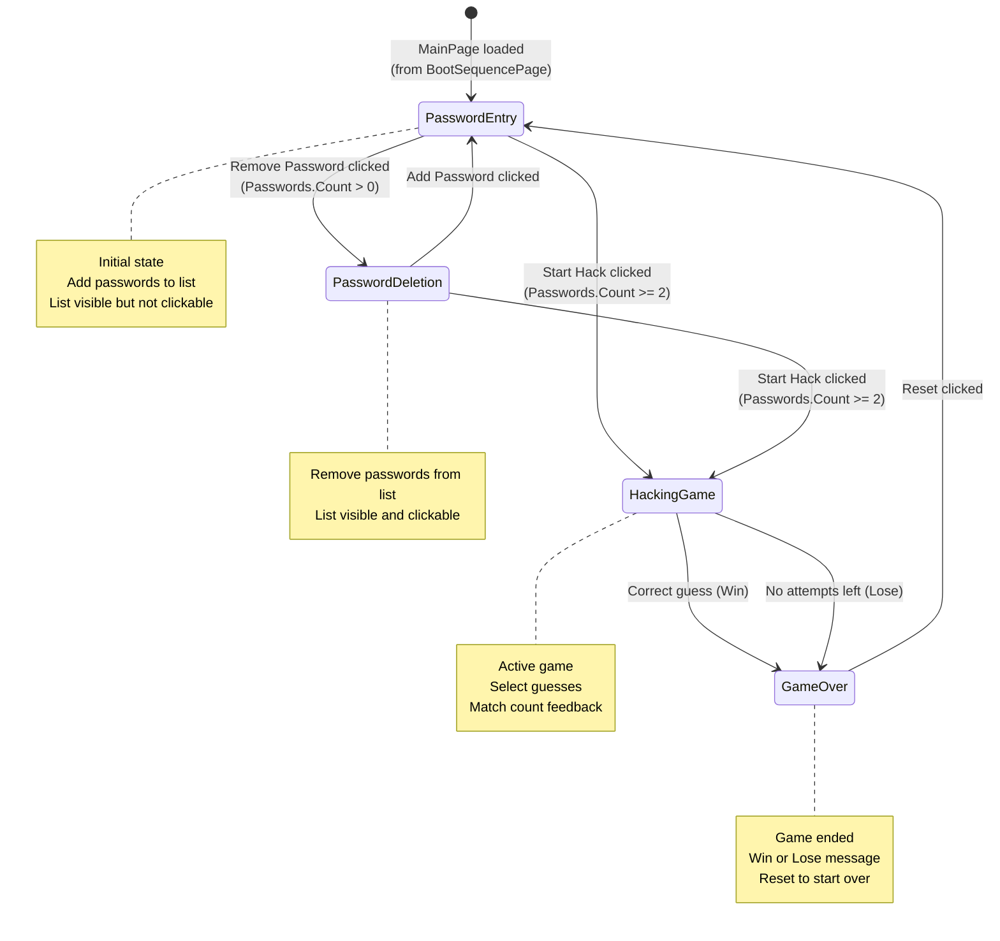
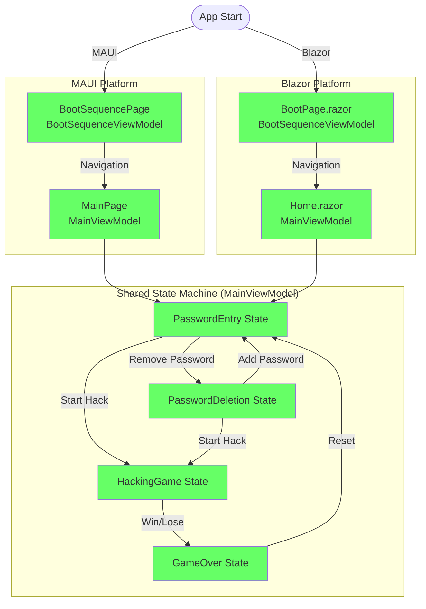

# Terminal Hacker State Machine Documentation

## Overview

The Terminal Hacker application uses a clean state machine pattern to manage the different modes of the main game screen. This document describes the states, transitions, and UI behavior for each state.

**Platform Support:** This state machine is used by both the **MAUI** and **Blazor** platforms:
- **MAUI**: `MainPage` (managed by `MainViewModel`)
- **Blazor**: `Home.razor` page (managed by `MainViewModel`)

**Note:** Both platforms start with a separate boot sequence screen:
- **MAUI**: `BootSequencePage` (managed by `BootSequenceViewModel`)
- **Blazor**: `BootPage.razor` (managed by `BootSequenceViewModel`)

After the boot sequence completes, the app transitions to the main game screen, which is where this state machine applies.

## Application Flow

### MAUI Platform
```
App Start → BootSequencePage (BootSequenceViewModel) → MainPage (MainViewModel)
                                                              ↓
                                                        PasswordEntry (initial state)
```

### Blazor Platform
```
App Start → BootPage.razor (BootSequenceViewModel) → Home.razor (MainViewModel)
                                                            ↓
                                                      PasswordEntry (initial state)
```

Both platforms share the same `MainViewModel` and state machine logic from the **Shared** project.

## States

### 1. PasswordEntry
The initial and default state where users can add passwords to the list.

**UI Behavior:**
- PasswordList: Visible but NOT enabled for selection
- PasswordEntry: Visible and enabled (if less than 20 passwords)
- AutocompleteSuggestions: Filtered to words.txt, excluding already added passwords
- "Add Password" button: Selected (highlighted)
- "Remove Password" button: Enabled if passwords exist
- "Start Hack" button: Enabled if passwords exist

**Entry Filtering:**
- Words from words.txt
- Minimum 4 characters (or matching length of first password)
- Not already in the PasswordList
- Maximum 20 passwords

### 2. PasswordDeletion
State where users can remove passwords from the list.

**UI Behavior:**
- PasswordList: Visible and ENABLED for selection
- PasswordEntry: Visible and enabled
- AutocompleteSuggestions: Filtered to passwords in PasswordList
- "Add Password" button: Enabled (can switch back)
- "Remove Password" button: Selected (highlighted)
- "Start Hack" button: Enabled if passwords exist

**Entry Filtering:**
- Only words from PasswordList
- Clicking a password in the list populates PasswordEntry
- Submitting removes the password

### 3. HackingGame
Active hacking game state.

**UI Behavior:**
- PasswordList: Visible and enabled (for selecting guesses)
- PasswordEntry: NOT visible
- RecommendedGuesses: Visible
- BestGuess controls: Visible
- Match count chips: Visible after password selection
- Action buttons (Add/Remove/Start): NOT visible
- "Reset" button: Visible (in StatusBar or separate control)

**Game Logic:**
- Only non-eliminated passwords are selectable
- After selecting a password, match count chips appear
- Selecting a match count submits the guess and eliminates passwords
- Game continues until win or lose condition

### 4. GameOver
Game has ended (win or lose).

**UI Behavior:**
- GameResult panel: Visible
- Win message: Shown if game was won
- Lose message: Shown if game was lost
- "Reset" button: Available to restart

## MainPage State Transitions



## Complete Application Flow (Both Platforms)



### Valid Transitions (MainViewModel State Machine)

| From | To | Condition |
|------|-----|-----------|
| PasswordEntry | PasswordDeletion | Passwords.Count > 0 |
| PasswordEntry | HackingGame | Passwords.Count >= 2 |
| PasswordDeletion | PasswordEntry | Always |
| PasswordDeletion | HackingGame | Passwords.Count >= 2 |
| HackingGame | GameOver | Game won or lost |
| GameOver | PasswordEntry | Always (via Reset) |

**Note:** The `PasswordEntry` state is the entry point when MainPage is loaded (after BootSequencePage navigation).

## Implementation Details

### MainViewModel Properties

**State Management:**
- `CurrentState`: The current GameState enum value
- `_isGameWon`: Private flag to distinguish win from lose in GameOver state

**UI Properties:**
- `ShowPasswordEntry`: Controls visibility of password entry section
- `ShowActionButtons`: Controls visibility of Add/Remove/Start buttons
- `ShowHackingGame`: Controls visibility of hacking game section
- `ShowGameResult`: Controls visibility of game result section
- `IsPasswordListEnabled`: Controls whether password list buttons are clickable
- `IsPasswordEntryEnabled`: Controls whether password entry input is enabled
- `IsAddPasswordSelected`: Indicates Add Password button selection state
- `IsRemovePasswordSelected`: Indicates Remove Password button selection state

### State Transition Methods

**TransitionToState(GameState newState)**
- Validates the transition using `IsValidTransition()`
- Updates `CurrentState`
- Calls `OnStateEntered()` for state-specific setup

**IsValidTransition(GameState from, GameState to)**
- Returns true if the transition is valid
- Enforces the state machine rules

**OnStateEntered(GameState state)**
- Performs state-specific initialization
- Called after entering a new state

### Command Methods

- `SetModeToAddPassword()`: Transitions to PasswordEntry state
- `SetModeToRemovePassword()`: Transitions to PasswordDeletion state
- `StartGameAsync()`: Transitions to HackingGame state
- `SubmitGuess()`: Transitions to GameOver state (if game ends)
- `ClearAll()`: Transitions to PasswordEntry state (resets game)

## Benefits of This Approach

1. **Clear State Definitions**: Each state has well-defined UI behavior
2. **Enforced Transitions**: Invalid state transitions are prevented
3. **Single Source of Truth**: `CurrentState` drives all UI properties
4. **Easy to Extend**: New states can be added by extending the enum and transition rules
5. **Testable**: State transitions and validations can be unit tested
6. **Maintainable**: Logic is centralized, not scattered across multiple boolean flags

## Migration from Old System

### Before (Multiple Boolean Flags)
- `IsGameActive`: true/false
- `IsGameWon`: true/false
- `IsGameLost`: true/false
- `CurrentMode`: AddPassword/RemovePassword enum

This could lead to invalid combinations (e.g., `IsGameWon` and `IsGameLost` both true).

### After (Single State Machine)
- `CurrentState`: PasswordEntry/PasswordDeletion/HackingGame/GameOver
- `_isGameWon`: private flag (only used in GameOver state)

Only valid combinations are possible by design.

 